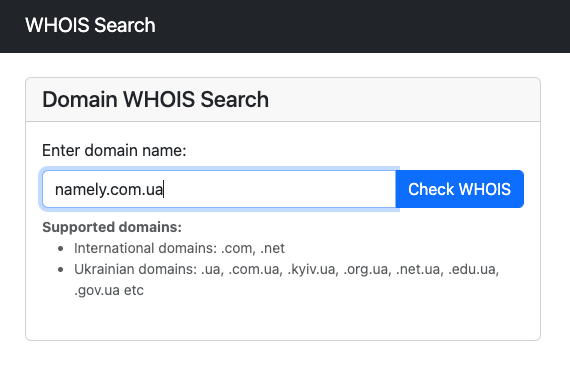

## Simple Whois project



It is writed on Laravel and help users to find open information about domains.

Before run the project you should:
 - create .env file from .env.example 
 - set the mysql database connection (create DB Schema and add it to .env file)

For run the project you should run the following commands:

```bash
composer install
php artisan migrate
php artisan key:generate
php artisan serve
```
